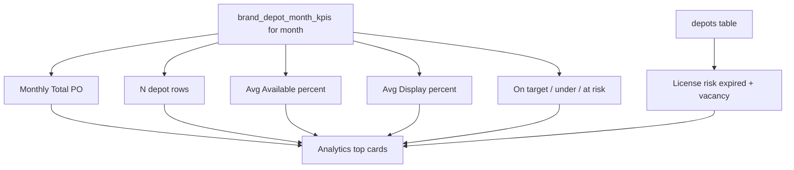

# Analytics Dashboard Cards Explained

What each top card on **Analytics** means, where the number comes from, and how it is calculated.

Screen: `shadcn-admin` → **Analytics**  
Data sources:

- Monthly KPI rows: `GET /api/v1/kpis/brand-monthly?year=&month=&brandId=`  
  (`brandMonthlyKpiService.getBrandMonthlyReport`)
- License / vacancy attention: `GET /api/v1/kpis/dashboard-insights?...`  
  (`brandMonthlyKpiService.getDashboardInsights`)

Filters on the page (**month**, **brand**) apply to all cards below.

---

## Snapshot of your example

| Card | Example value | Plain meaning |
|------|---------------|---------------|
| **Monthly Total PO** | (a number) | Sum of all PO actuals for the month |
| hint | **20 depot rows** | 20 depot×brand KPI rows in that month |
| **Avg Available %** | e.g. 92.5% | Average product availability % across rows that have a value |
| **Avg Display %** | e.g. 85.0% | Average volume display % across rows that have a value |
| **On target** | e.g. `8/20` | 8 of 20 rows hit ≥100% PO % |
| hint | **4 under · 8 at risk** | 4 rows &lt;80% PO %, 8 rows between 80–99% |
| **License risk** | e.g. `12` | Count of expired licenses + vacancy depots needing attention |

---

## 1. Monthly Total PO

**What it is:** Total purchase orders completed in the selected month (for the selected brand, or all brands).

**Formula:**

\[
\text{Monthly Total PO} = \sum \text{poActual}
\]

over every `brand_depot_month_kpis` row for that month (and brand filter).

**Source field:** `poActual` (# PO entered by managers / import).

**Not the same as:** PO target. This card is **actuals only**.

---

## 2. “N depot rows” (hint under Total PO)

**What it is:** How many **depot × brand** KPI rows exist for that month after filters.

- One depot under one brand in one month = **1 row**
- Same depot under two brands = **2 rows**
- A depot with no KPI row for that month is **not** counted

So **20 depot rows** means 20 scorecard lines, not necessarily 20 unique depot IDs.

---

## 3. Avg Available %

**What it is:** Average **product availability %** for the month.

**Formula:**

\[
\text{Avg Available \%} = \dfrac{\sum \text{productAvailablePct}}{\text{count of rows where Available is not empty}}
\]

- Only rows with a non-null `% Available` are included.
- If no row has Available %, the card shows **—**.

**Important:** This value is **manager-entered / imported**. The system does **not** calculate it from stock tables today.

---

## 4. Avg Display %

**What it is:** Average **volume display %** for the month.

**Formula:**

\[
\text{Avg Display \%} = \dfrac{\sum \text{volumeDisplayPct}}{\text{count of rows where Display is not empty}}
\]

Same rules as Available % (skip empty, show — if none).

Also **entered / imported**, not derived from stock.

---

## 5. On target · under · at risk

These come from each row’s **PO %**:

\[
\text{PO \%} = \begin{cases}
\dfrac{\text{poActual}}{\text{poTarget}} \times 100 & \text{if poTarget} > 0 \\
\text{(missing)} & \text{otherwise}
\end{cases}
\]

Frontend rounds PO % to a whole number for status badges (`Math.round`).

### Status bands (Analytics)

| Status | Condition | Meaning |
|--------|-----------|---------|
| **On target** | PO % ≥ **100** | Met or beat the PO target |
| **At risk** | PO % ≥ **80** and &lt; **100** | Close, but not fully on target |
| **Under** | PO % &lt; **80** | Clearly behind target |
| **Missing** | No target (or cannot compute %) | Target not set / incomplete |

### Card display

- Big number: **`onTarget / depotRows`**  
  Example: `8/20` → 8 rows on target out of 20 rows.
- Hint: **`4 under · 8 at risk`**  
  - `under` = count of `under_target`  
  - `at risk` = count of `at_risk`

Rows with **missing** target are not counted in under/at-risk, but they still sit in the total depot-row count.

### Worked example

| Depot | # PO | # Target | PO % | Status |
|-------|------|----------|------|--------|
| A | 120 | 100 | 120% | On target |
| B | 90 | 100 | 90% | At risk |
| C | 70 | 100 | 70% | Under |
| D | 50 | — | — | Missing |

If these were the only rows: On target `1/4`, hint `1 under · 1 at risk`.

---

## 6. License risk

**What it is:** How many depots need attention for **license / ID expiry** or **vacancy** (not PO performance).

**Big number:**

\[
\text{License risk} = \text{expired count} + \text{vacancy count}
\]

**Hint:** `X expired · Y vacancy`

| Type | Rule |
|------|------|
| **Expired** | Depot `expiryDate` is **before today** |
| **Vacancy** | Depot `status === "vacancy"` |

These come from dashboard **attention** items (`type: expired` / `type: vacancy`), scoped by the selected brand when a brand filter is set.

**Not included in this card:** under-target PO, missing Available/Display (those appear in other insight lists).

---

## Data flow (simple)

---

## Where to change logic in code

| Topic | File |
|-------|------|
| Monthly totals / averages | `Backend/src/services/brandMonthlyKpiService.js` → `getBrandMonthlyReport` |
| License / vacancy attention | same file → `getDashboardInsights` |
| On target / at risk / under bands | `shadcn-admin/src/lib/performance-status.ts` |
| Card UI | `shadcn-admin/src/features/analytics/index.tsx` |

---

## Related docs

- [KPI_CALCULATION.md](./KPI_CALCULATION.md) — PO %, ranking, scorecard, import mapping  
- [KPI_ARCHITECTURE.md](./KPI_ARCHITECTURE.md) — tables and API overview  
