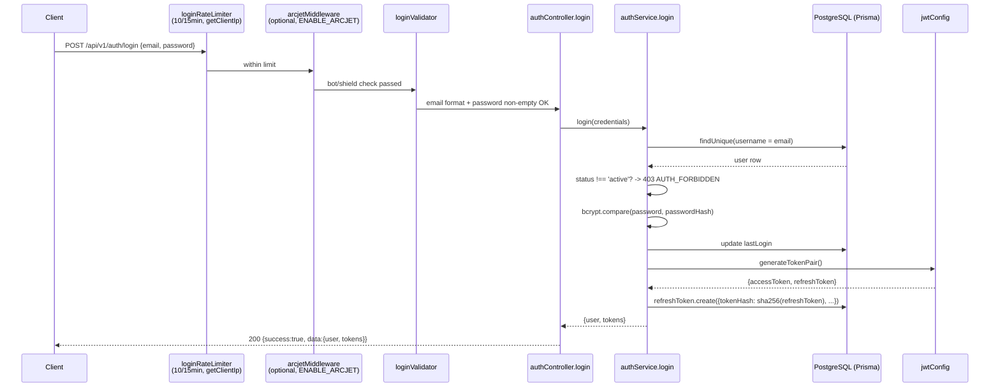
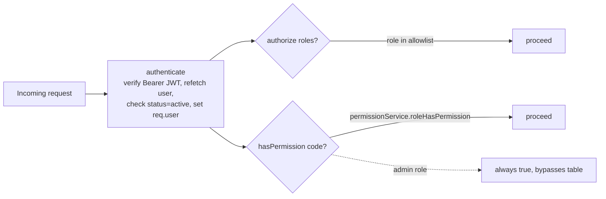
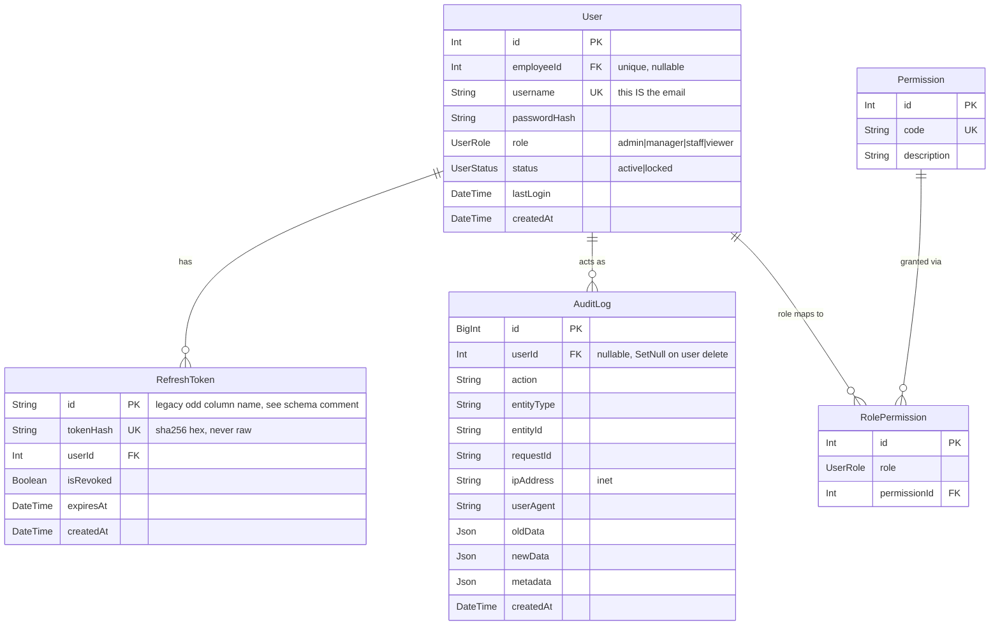
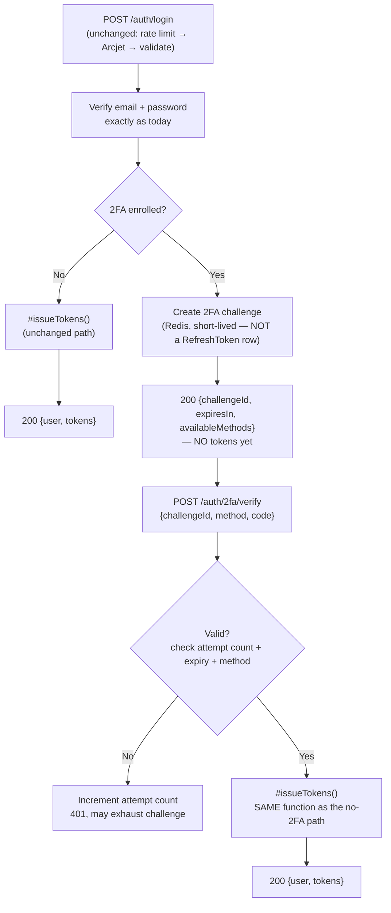
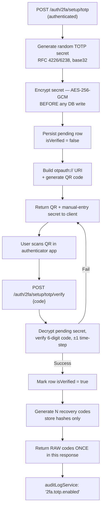
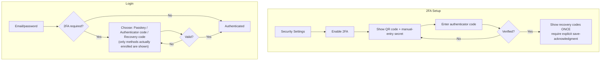

# 2FA Architecture Audit

Analysis-only document — no code, schema, or dependencies were changed while producing this. It documents the **actual** current authentication implementation (file/line-verified) and proposes a Two-Factor Authentication architecture (WebAuthn preferred, TOTP required fallback, recovery codes) adapted to this codebase's real conventions, not a generic template.

Scope: `Backend/` (Node.js + Express 5 + Prisma 7 + PostgreSQL).

---

## Table of contents

1. [Current Authentication Architecture](#1-current-authentication-architecture)
2. [Current Authorization Architecture](#2-current-authorization-architecture)
3. [Current Database Architecture](#3-current-database-architecture)
4. [Current Redis Architecture](#4-current-redis-architecture--not-actually-in-use)
5. [Current Security Posture](#5-current-security-posture)
6. [Existing Security Findings](#6-existing-security-findings)
7. [Recommended 2FA Architecture](#7-recommended-2fa-architecture)
8. [Login Flow](#8-login-flow)
9. [2FA Setup Flow](#9-2fa-setup-flow)
10. [TOTP Secret Security](#10-totp-secret-security)
11. [Recovery Codes](#11-recovery-codes)
12. [2FA Challenge Security](#12-2fa-challenge-security)
13. [Rate Limiting](#13-rate-limiting)
14. [Sensitive Operations (step-up auth)](#14-sensitive-operations-step-up-authentication)
15. [Prisma Schema Proposal](#15-prisma-schema-proposal-proposal-only--not-applied)
16. [API Proposal](#16-api-proposal)
17. [Required Dependencies](#17-required-dependencies)
18. [Frontend Requirements](#18-frontend-requirements-flows-only-no-implementation)
19. [Threat Model](#19-threat-model)
20. [Security Event Audit](#20-security-event-audit)
21. [Production Deployment Requirements](#21-production-deployment-requirements)
22. [Testing Strategy](#22-testing-strategy)
23. [Existing Problems (consolidated)](#23-identify-existing-problems-first)
24. [Migration Strategy](#24-migration-strategy)
25. [Implementation Plan](#25-implementation-plan-phase-1-13-adjusted-to-this-repo)
26. [Files That Will Need Modification](#26-files-that-will-need-modification)
27. [Files That Should NOT Be Modified](#27-files-that-should-not-be-modified)
28. [Risks / Open Questions](#28-risks--open-questions)
29. [Recommended Implementation Order](#29-recommended-implementation-order)

---

## 1. Current Authentication Architecture

**Flow**: `src/routes/authRoutes.js` → `src/controllers/authController.js` → `src/services/authService.js` → `src/config/jwt.js` + Prisma.



- **Password hashing**: `bcryptjs`, cost factor `10` (`authService.js`, `bcrypt.hash(password, 10)`). No login-time complexity check (only "non-empty"); `changePassword`/`resetPassword` require 6+ chars with a letter and a digit — **user *creation* only requires 6 chars, no letter/digit rule** (`userService.createUser`) — see [§6](#6-existing-security-findings).
- **JWT**: `jsonwebtoken`, algorithm `HS256`, **separate secrets** for access (`JWT_SECRET`) and refresh (`JWT_REFRESH_SECRET`). Each token carries a `type` claim (`'access'`/`'refresh'`) so one can't be replayed as the other. Claims: `userId, email, role, name, type, iat, exp, iss, aud`.
- **Lifetimes**: access `JWT_ACCESS_EXPIRY` (code default `7d` if unset), refresh `JWT_REFRESH_EXPIRY` (code default `7d`, but `.env.example` documents `30d` — a real inconsistency, see [§6](#6-existing-security-findings)).
- **Secret management**: `src/config/env.js` fails fast in production if `JWT_SECRET`/`JWT_REFRESH_SECRET`/`DATABASE_URL` are unset; dev/test fall back to a fixed, clearly-labeled insecure string (never a per-boot random value — that was a real bug fixed earlier this project).
- **Refresh token storage/rotation**: DB-persisted (`RefreshToken` model, table `refresh_tokens`) storing a **SHA-256 hash only**, never the raw token. Every successful `POST /auth/refresh` revokes the presented token's row and issues + persists a brand-new pair (full rotation). Reuse of an already-revoked token is detected and logged (`logger.warn`, not yet routed through the audit log — see [§6](#6-existing-security-findings)/[§20](#20-security-event-audit)).
- **Token storage (client)**: tokens are returned as plain JSON, never as cookies (zero `res.cookie(` calls anywhere in `src/`). Frontend stores them client-side (`depo-system-frontend/src/lib/session.ts`).
- **Cookies**: `cookie-parser` is registered and `middleware/auth.js`'s `extractToken` helper checks `req.cookies?.accessToken` as a fallback — but this is **dead code**: the live `authenticate` middleware parses the `Authorization` header directly and never calls `extractToken`, and nothing anywhere ever sets that cookie.
- **Logout**: `POST /auth/logout` (authenticated) hashes the presented refresh token and revokes any matching, non-revoked row. Idempotent — a repeat call, or one with a garbage/expired token, still returns success.
- **Password reset**: `POST /auth/forgot-password` (rate-limited 5/hour) always returns an identical response regardless of whether the email exists, is inactive, is inside the resend cooldown, or delivery failed (delivery errors are logged, never thrown — a 500 only for real accounts would itself leak which emails exist). A found, active user gets a 6-digit code from `services/passwordResetOtpService.js` (Redis, like the login challenge): stored only as an HMAC keyed with the JWT secret, 10-minute TTL, at most 5 guesses (the code is destroyed on the last miss), single-use (atomic `DEL` decides a race), one issue per 60s per user. It is emailed via `config/mailer.js` (SMTP, e.g. Resend; logs the message instead if unconfigured). `POST /auth/reset-password` (rate-limited 10/15min) takes `{email, otp, newPassword}`; every failure (unknown/inactive account, wrong/expired/used code, too many attempts) returns the same 401 `Invalid or expired verification code`. On success it sets the password and revokes every outstanding refresh token for that user in the same transaction.

## 2. Current Authorization Architecture



- **`authenticate`** (`middleware/auth.js`): parses `Authorization: Bearer <token>`, verifies via `jwtConfig.verifyAccessToken`, re-fetches the user fresh from the DB (not trusting stale token claims for role/status), rejects if `status !== 'active'`, sets `req.user = {id, username, role, status, createdAt}`, and feeds the AsyncLocalStorage request-context used by structured logging/audit logging.
- **`authorize(...roles)`**: allowlist check against `req.user.role`.
- **`hasPermission(code)`**: calls `permissionService.roleHasPermission(role, code)`. **`admin` unconditionally bypasses** the `Permission`/`RolePermission` table (hard-coded `true`); other roles are checked against a 60-second in-memory cache of the join table.
- **Roles** (`UserRole` enum): `admin | manager | staff | viewer`.

**Can 2FA be added without breaking authorization?** Yes, cleanly. `authenticate` is the single chokepoint populating `req.user`, and every downstream check only reads `req.user.role`. 2FA slots in *before* a normal token is ever issued: `authService.login` stops returning full tokens immediately for 2FA-enrolled users and instead returns a short-lived challenge. `authenticate`/`authorize`/`hasPermission` need **zero changes** — they only ever see tokens for sessions that already cleared 2FA.

## 3. Current Database Architecture



Key facts (schema fully read, 642 lines):

- `User.id` is a plain autoincrement `Int` — every proposed 2FA table below FKs on `Int`, matching this, not `RefreshToken.id`'s legacy `String` PK.
- `RefreshToken.user` cascades on delete (deleting a user drops their tokens); `AuditLog.user` uses `SetNull` (deleting a user preserves the audit trail, nulling the actor) — the precedent new 2FA tables should follow: session/device-scoped data cascades, audit-shaped data nulls out.
- **No `Session`, `TwoFactor`, `WebAuthn`, `RecoveryCode`, `OTP`, or `DeviceTrust` model exists anywhere in the schema** (verified by reading it in full).
- `RefreshToken`'s physical columns are literally named `refresh_tokens_pkey`/`refresh_tokens_token_key` (a historical migration mistake, documented in the schema's own comment) — Prisma's `@map` hides this behind clean `id`/`tokenHash` field names for application code. Not something to replicate; just noted so new tables don't inherit the pattern.

## 4. Current Redis Architecture — not actually in use

`@upstash/redis`, `connect-redis`, `express-session` are all `package.json` dependencies, and three files exist that look like a working session/cache layer — but **none is imported anywhere else in `src/`, and none is wired into `app.js`'s middleware chain**:

| File | What it does | Why it's dead |
|---|---|---|
| `src/config/upstash.js` | Creates an `@upstash/redis` client | No `export` statement at all — unusable even if imported. Not imported anywhere. |
| `src/middleware/sessionStore.js` | Builds an `express-session` instance backed by `connect-redis` | Never imported into `app.js`. Also **broken**: calls `connect-redis`'s v6 factory API (`ConnectRedis(session)`) against the installed v9 package (a bare class export) — would throw if ever imported. |
| `src/middleware/cacheMiddleware.js` | GET-response cache via Redis | Imports `../config/redis.js`, which **does not exist**. Never imported anywhere either. |

At the time of this audit, `docker-compose.yml` had no Redis service and set no `SESSION_SECRET`/`UPSTASH_REDIS_REST_URL`/`_TOKEN` — confirming none of this was ever part of the deployed configuration. Same dead-dependency pattern as `sequelize`/`joi`, which were removed from this codebase earlier. (A `redis` service has since been added to `docker-compose.yml` for the 2FA challenge store specifically — see [§12](#12-2fa-challenge-security)/[§21](#21-production-deployment-requirements) — which is unrelated to, and does not revive, the three dead files above.)

**Decision: Redis, self-hosted — not Upstash.** `@upstash/redis`'s REST-based serverless model is explicitly out (per direction — a third-party managed dependency wasn't wanted). Instead, this design adds a real `redis` service to `docker-compose.yml` (alongside the existing `postgres` service) and talks to it with a plain TCP client (`ioredis`), independent of the three dead files above — `config/upstash.js`/`middleware/sessionStore.js`/`middleware/cacheMiddleware.js` stay exactly what they are today (unused, one broken against its own dependency's API version) and are not resurrected or reused; the new 2FA challenge store is a fresh, small piece of code, not a repair of the old ones. See [§12](#12-2fa-challenge-security) for the challenge design itself and the docker-compose addition.

## 5. Current Security Posture

**Password security**: bcryptjs cost 10 — acceptable, not a finding. Complexity enforced on change/reset, not on creation (inconsistency, see [§6](#6-existing-security-findings)).

**JWT**: HS256, separate access/refresh secrets, fail-fast secret validation in production, no access-token revocation (by design — short-lived and stateless), refresh rotation + reuse detection.

**Cookies**: not used for auth at all — HttpOnly/Secure/SameSite are not applicable since no auth cookie exists today.

**Rate limiting** (all `express-rate-limit`, keyed via `getClientIp()` which prefers Cloudflare's `CF-Connecting-IP` over spoofable `X-Forwarded-For`):

| Endpoint | Limit |
|---|---|
| `POST /auth/login` | 10 / 15 min + optional Arcjet (default off) |
| `POST /auth/forgot-password` | 5 / hour |
| `POST /auth/reset-password` | 10 / 15 min |
| General `/api/*` | 200 / 15 min (default off) |

In-memory store — correct for the current single-instance deployment, needs Redis-backing if a second instance is ever added.

**Account enumeration**: login returns the same status/error-code for "user not found" vs "wrong password," but **different message text** — a partial mitigation. `forgot-password` is fully enumeration-safe.

**Audit logging**: `AuditLog` model + `auditLogService.js` exist and are wired into login success/failure and user CRUD. **Not yet wired into** refresh-token reuse detection or password-reset events (both currently Winston-only).

## 6. Existing Security Findings

| Severity | Finding | File | Current Behavior | Risk | Recommendation |
|---|---|---|---|---|---|
| High | No test coverage for auth/JWT/password/permission logic anywhere in the repo | `src/` (7 test files exist, all Telegram/KPI domain — verified by absence) | Auth changes ship with zero regression safety net | A 2FA regression could ship undetected | Add tests for the *existing* flow before/alongside 2FA ([§22](#22-testing-strategy)) |
| Medium | Dead Redis/session scaffolding in `package.json` and `src/` | see [§4](#4-current-redis-architecture--not-actually-in-use) | Unused deps; two files would throw if ever imported | Misleading dead code | Remove, or deliberately repurpose for 2FA challenges — don't build on these specific files |
| Medium | Login leaks distinguishable error *messages* even though status/code are unified | `authService.js` `login()` | "User not found" vs "Invalid password" text differs | Message-based account enumeration | Unify message text too, not just the code |
| Medium | Password complexity inconsistent: creation (6 chars) vs change (6 chars + letter + digit) | `userService.createUser` vs `authValidator.changePasswordValidator` | Weaker bar at account creation | Weak passwords possible at creation time | Align validators |
| Low | `admin` role bypasses `RolePermission` table entirely | `permissionService.js` | Hardcoded `true` for admin | Can't gate "require 2FA for admins" via the permission system | Use a direct role check or a dedicated flag for 2FA-mandatory policies |
| Low | `JWT_REFRESH_EXPIRY` doc (`30d`) vs code default (`7d`) mismatch | `.env.example` vs `config/jwt.js` | Cosmetic, no live bug | Confusing fresh-environment setup | Align the two |
| Low | `extractToken`'s cookie fallback is dead/unreachable | `middleware/auth.js` | Never invoked by the live path | None currently | Remove, or wire in deliberately if a 2FA challenge is ever cookie-delivered |
| Info | Refresh-token reuse is logged via Winston only, not the audit log | `authService.js` `refreshToken()` | Not persisted as a structured, queryable row | Minor observability gap | Route through `auditLogService`, same as new 2FA events ([§20](#20-security-event-audit)) |
| Info | `docker-compose.yml` has hardcoded placeholder secrets | `docker-compose.yml` | Dev-only file (not verified if ever used as a prod template) | Low, contained | No action needed unless usage is confirmed |

No CRITICAL findings remain open — the critical items (broken logout, random-per-boot JWT secret, unhashed/unpersisted refresh tokens, global TLS-verification override) were already fixed in this codebase's history.

## 7. Recommended 2FA Architecture

**WebAuthn/passkeys as the preferred factor, TOTP as the required fallback, recovery codes for account recovery.** This fits the codebase well: zero existing cookie dependency (WebAuthn is naturally bearer/JSON-friendly here), an existing JWT layer already discriminating token `type` (extendable with a `2fa_challenge` type or replaced by an opaque Redis-backed ID), and a working audit-log/rate-limit/client-IP foundation to hang every 2FA event off rather than build from scratch.

## 8. Login Flow



**Adapting the existing implementation**: `authService.login()` changes from "always call `#issueTokens`" to "call it only when no 2FA is enrolled; otherwise create and return a challenge." `#issueTokens` itself needs **zero changes** — already the single, shared token-issuance path for both login and the (now 2FA-aware) verify step. `authController.login`'s response shape gains a discriminated union (`{tokens}` vs `{challengeId, availableMethods}`) for 2FA-enrolled users only; non-enrolled users see byte-identical behavior to today.

**Enumeration care**: revealing "this account has 2FA" only happens *after* password verification (unavoidable and standard — they've already proven they know the password). The leak to avoid is *pre*-password-verification enumeration, which this design already respects.

## 9. 2FA Setup Flow



All of this lives in a **new** `twoFactorService.js`/`twoFactorController.js`, following the exact conventions already established in `authService.js`/`authController.js` (Express 5 native async-rejection handling, `AppError` for expected failures, no manual try/catch except where a controller needs a side effect on the failure path).

## 10. TOTP Secret Security

**Never hash** the TOTP secret — it must be recoverable to generate the expected code on each verification. Recommend **AES-256-GCM**, using Node's built-in `crypto` module (already used this way in `authService.js` for hashing/random IDs — zero new dependency).

- **Key management**: a new required env var, e.g. `TOTP_ENCRYPTION_KEY` (32 raw bytes), joining the same production fail-fast list `config/env.js` already enforces for `JWT_SECRET`/`JWT_REFRESH_SECRET`/`DATABASE_URL`.
- **Key rotation**: store a `keyVersion` integer alongside each encrypted secret so a future rotation can decrypt-with-old/re-encrypt-with-new per row without a hard cutover.
- **Nonce/IV**: fresh 12-byte IV per encryption (`crypto.randomBytes(12)`), stored alongside the ciphertext, never reused or derived from user data.
- **Authentication tag**: GCM's 16-byte tag must be stored and checked on decrypt — reject on mismatch, never fall back to unauthenticated decryption.
- **DB representation**: explicit typed columns (`secretCiphertext`, `secretIv`, `secretAuthTag` as `Bytes`) rather than one packed blob — matches this schema's general style (explicit columns over JSON blobs, e.g. `RefreshToken`).

## 11. Recovery Codes

- **Generation**: `crypto.randomBytes`, formatted as human-typeable groups — cryptographically secure by construction.
- **Display**: returned once (setup-verify and regenerate responses only), never retrievable again — matches this codebase's existing instinct to never re-expose sensitive material (e.g. `passwordHash` is never included in any profile output).
- **Storage**: SHA-256 hash only — direct reuse of the same pattern `authService.js` already applies to refresh tokens.
- **Single-use**: a nullable `usedAt: DateTime?` column (null = unused) — same idiom as `RefreshToken.isRevoked`, but a timestamp is more useful here since "when used" is itself audit-relevant.
- **Regeneration**: invalidate every previous code for the user in the **same transaction** that creates the new batch — direct precedent already exists in `authService.resetPassword`'s `prisma.$transaction([update password, revoke refresh tokens])`.
- **Step-up required**: regeneration must require recent re-authentication ([§14](#14-sensitive-operations-step-up-authentication)) — otherwise a stolen access token alone could mint a fresh recovery-code batch for the attacker.

## 12. 2FA Challenge Security

Must be a **distinct token type**, not a scoped-down access token — mirroring `jwt.js`'s existing `type` discrimination (`access`/`refresh`/`reset`/`verify`).

**Decision: Redis, self-hosted via docker-compose** (not Upstash — see [§4](#4-current-redis-architecture--not-actually-in-use)). Short-lived (minutes), high-write-per-attempt, zero durability requirement — exactly the profile Redis suits and Postgres doesn't. A new `redis` service joins `docker-compose.yml` alongside the existing `postgres` service ([§21](#21-production-deployment-requirements) has the compose snippet), reached over plain TCP via `ioredis` — a fresh, small client module, unrelated to the dead `@upstash/redis`/`sessionStore.js`/`cacheMiddleware.js` files.

```text
2fa:challenge:<challengeId>   (Redis key, EXPIRE'd at TTL)
├── challengeId    — crypto.randomUUID()
├── userId
├── createdAt / expiresAt
├── attemptCount    — INCR'd atomically per verify
├── maxAttempts     — e.g. 5 → DEL the challenge outright once hit
└── methodsAvailable — only methods this user actually enrolled
```

**TTL recommendation**: 5 minutes — long enough to reach for a phone, short enough to bound the brute-force window even before `maxAttempts` triggers. Explicitly a starting value to tune.

**Failure mode**: Redis becomes a new hard dependency for any 2FA-enrolled login. If it's unreachable, **hard-fail** the login attempt for 2FA-enrolled users rather than silently skipping the second factor — never degrade a security control because infrastructure is down. Non-2FA users are entirely unaffected either way (their login never touches Redis).

**Postgres alternative, documented for completeness (not the chosen design)**: a `LoginChallenge` table with the same fields plus an `expiresAt` index, atomic increment via Prisma's `update({ data: { attemptCount: { increment: 1 } } })`, and a periodic cleanup job deleting expired rows (`jobs/cleanupToken.js` already exists in this repo as an empty, unimplemented placeholder — would be the natural home for it if this path is ever needed instead, e.g. to drop the Redis dependency later).

## 13. Rate Limiting

Extending the existing `authRateLimiter(...)` factory (`authRoutes.js`) — same `getClientIp`-based keying:

| Endpoint | Starting limit | Key |
|---|---|---|
| `POST /auth/2fa/verify` | 5 / 5 min | `challengeId` — not just IP, since brute force targets one challenge |
| `POST /auth/2fa/setup/totp/verify` | 5 / 15 min | authenticated user id |
| `POST /auth/2fa/recovery` | 5 / 15 min | `challengeId` + IP — recovery codes are higher-value targets |
| `POST /auth/2fa/disable` | 5 / hour | user id — also gated by step-up ([§14](#14-sensitive-operations-step-up-authentication)) |

The Redis challenge's own `maxAttempts` ([§12](#12-2fa-challenge-security)) is the authoritative per-challenge brute-force stop; `express-rate-limit` above is the IP/user-level backstop — same defense-in-depth relationship login already has (Arcjet + dedicated limiter). All limits labeled as starting values to tune. **Distributed-deployment note**: today's single-instance deployment makes `express-rate-limit`'s in-memory store correct for the other limiters in this table; since Redis is now part of the stack for the challenge itself ([§12](#12-2fa-challenge-security)), moving the rest of the rate limiters onto `rate-limit-redis` later (if a second app instance is ever added) is a small, low-risk follow-up rather than new infrastructure.

## 14. Sensitive Operations (step-up authentication)

None of the following currently require anything beyond a valid access token: `changePassword`, `updateProfile`. Recommend requiring **current password (or 2FA code) inline in the request body** — the same pattern `changePassword` already uses — for:

```text
Change password          (already does this)
Change email/username
Disable 2FA
Regenerate recovery codes
Register a new passkey
```

Recommended over a claims-based "session freshness" system: lower complexity, matches an existing precedent exactly, sufficient at this app's scale.

## 15. Prisma Schema Proposal (proposal only — not applied)

Adapted to this schema's real conventions: `Int` autoincrement PKs, `snake_case` `@map`, explicit typed columns, `onDelete: Cascade` for session-scoped child data.

```prisma
model UserTwoFactor {
  id               Int             @id @default(autoincrement())
  userId           Int             @unique @map("user_id")
  method           TwoFactorMethod @default(totp)
  secretCiphertext Bytes           @map("secret_ciphertext")
  secretIv         Bytes           @map("secret_iv")
  secretAuthTag    Bytes           @map("secret_auth_tag")
  keyVersion       Int             @default(1) @map("key_version")
  isVerified       Boolean         @default(false) @map("is_verified")
  createdAt        DateTime        @default(now()) @map("created_at")
  verifiedAt       DateTime?       @map("verified_at")

  user User @relation(fields: [userId], references: [id], onDelete: Cascade)
  @@map("user_two_factor")
}
// One row per user's TOTP enrollment (@unique userId). isVerified gates whether
// login actually enforces it — a half-completed setup must not lock anyone out
// or silently half-enable 2FA. Secret is never stored plaintext.

model WebAuthnCredential {
  id           Int      @id @default(autoincrement())
  userId       Int      @map("user_id")
  credentialId String   @unique @map("credential_id")
  publicKey    Bytes    @map("public_key")
  counter      BigInt   @default(0)
  deviceName   String?  @map("device_name")
  transports   String[] @map("transports")
  createdAt    DateTime @default(now()) @map("created_at")
  lastUsedAt   DateTime? @map("last_used_at")

  user User @relation(fields: [userId], references: [id], onDelete: Cascade)
  @@index([userId], map: "idx_webauthn_credentials_user_id")
  @@map("webauthn_credentials")
}
// Multiple rows per user (one per passkey/security key), unlike UserTwoFactor's
// one-per-user TOTP secret. counter must be checked non-decreasing on every
// auth — standard WebAuthn cloned-authenticator detection.

model RecoveryCode {
  id        Int       @id @default(autoincrement())
  userId    Int       @map("user_id")
  codeHash  String    @unique @map("code_hash")
  usedAt    DateTime? @map("used_at")
  createdAt DateTime  @default(now()) @map("created_at")

  user User @relation(fields: [userId], references: [id], onDelete: Cascade)
  @@index([userId], map: "idx_recovery_codes_user_id")
  @@map("recovery_codes")
}
// One row per generated code (typically 10/batch). Regeneration deletes all
// prior rows in the SAME transaction that inserts the new batch — mirrors
// authService.resetPassword's existing $transaction pattern.

enum TwoFactorMethod {
  totp
}
```

Add to `User`: `twoFactor UserTwoFactor?`, `webauthnCredentials WebAuthnCredential[]`, `recoveryCodes RecoveryCode[]`.

**Not proposed as a schema addition**: a `LoginChallenge` table — the challenge lives in Redis ([§12](#12-2fa-challenge-security)), not Postgres, per the chosen design. Its Postgres-equivalent shape is documented in §12 for reference only, in case Redis is ever dropped later.

## 16. API Proposal

Following existing conventions exactly: `/api/v1/auth/*`, `express-validator` per route, controllers with no manual try/catch (Express 5 native rejection forwarding), `AppError`/`ErrorCodes` for thrown errors, rate limiters defined route-adjacent, `authenticate` for anything requiring a logged-in user.

| Method & Path | Auth | Rate limit | Notes |
|---|---|---|---|
| `POST /api/v1/auth/2fa/setup/totp` | `authenticate` | 5/15min (user) | starts enrollment; secret persisted, `isVerified=false` |
| `POST /api/v1/auth/2fa/setup/totp/verify` | `authenticate` | 5/15min (user) | confirms enrollment, returns recovery codes once |
| `GET /api/v1/auth/2fa/status` | `authenticate` | — | `{enabled, method, webauthnCredentialCount, recoveryCodesRemaining}` |
| `POST /api/v1/auth/2fa/verify` | challenge-scoped | 5/5min (`challengeId`) | `{challengeId, code}` → tokens |
| `POST /api/v1/auth/2fa/recovery` | challenge-scoped | 5/15min (`challengeId`+IP) | `{challengeId, recoveryCode}` → tokens, marks code used |
| `POST /api/v1/auth/2fa/disable` | `authenticate` + step-up | 5/hour (user) | requires current password/2FA code |
| `POST /api/v1/auth/2fa/recovery-codes/regenerate` | `authenticate` + step-up | 5/hour (user) | invalidates old batch |
| `POST /api/v1/auth/webauthn/register/options` | `authenticate` | 10/15min (user) | `PublicKeyCredentialCreationOptions` |
| `POST /api/v1/auth/webauthn/register/verify` | `authenticate` | 10/15min (user) | persists `WebAuthnCredential` |
| `POST /api/v1/auth/webauthn/login/options` | none | 10/15min (IP) | |
| `POST /api/v1/auth/webauthn/login/verify` | challenge-scoped | 5/5min (`challengeId`) | → tokens |

`POST /api/v1/auth/login`'s response shape gains the discriminated `{tokens}` vs `{challengeId, availableMethods}` union ([§8](#8-login-flow)) — the one disclosed contract change to an existing endpoint.

## 17. Required Dependencies

**Already installed, reusable — zero new packages needed for**: `jsonwebtoken`, Node's built-in `crypto` (AES-256-GCM, random bytes, SHA-256 — already used this way in `authService.js`), `express-rate-limit`, `express-validator`.

**New packages needed**:

| Package | Purpose | Why needed | Alternative considered |
|---|---|---|---|
| `otplib` | TOTP generation/verification (RFC 6238) | Actively maintained, zero-dependency; hand-rolling HMAC-based TOTP is unnecessary risk | `speakeasy` — unmaintained, avoid |
| `qrcode` | Server-side QR generation from the `otpauth://` URI | Small, maintained, outputs PNG/SVG/data-URI directly | Client-side QR rendering instead — valid, avoids a backend dependency; worth deciding with frontend |
| `@simplewebauthn/server` | WebAuthn ceremony (challenge gen, attestation/assertion verification, counter check) | The maintained Node standard, pairs with `@simplewebauthn/browser` on the frontend | None reasonable — hand-rolling WebAuthn verification is explicitly discouraged by the spec itself |
| `ioredis` | TCP Redis client for the 2FA challenge store | Self-hosted Redis via `docker-compose` ([§21](#21-production-deployment-requirements)), plain TCP — not Upstash's REST model, so `@upstash/redis` (already a dependency, currently dead code, [§4](#4-current-redis-architecture--not-actually-in-use)) isn't the right client here. `ioredis` is the standard, actively maintained TCP client for Node | `node-redis` (`redis` package) — also viable and maintained; `ioredis` is chosen for built-in cluster/sentinel support if this ever needs to scale beyond a single Redis instance |

Do **not** reinstate `express-session`/`connect-redis` — the challenge design ([§12](#12-2fa-challenge-security)) is a client-held `challengeId` looked up directly in Redis, not a cookie-backed session; reintroducing those would repeat the exact dead-code pattern in [§4](#4-current-redis-architecture--not-actually-in-use). Also leave `@upstash/redis` alone — it's for a different (REST/serverless) Redis access pattern than the self-hosted TCP instance this design uses.

## 18. Frontend Requirements (flows only, no implementation)



Account management additionally needs a "Disable 2FA" and "Regenerate recovery codes" action, each prompting for current password (step-up, [§14](#14-sensitive-operations-step-up-authentication)) before calling their endpoint.

## 19. Threat Model

| Threat | Impact | Current protection | Recommended protection |
|---|---|---|---|
| Password compromise | Full account takeover | bcrypt-10, rate-limited login, optional Arcjet | 2FA itself — the point of this project |
| TOTP secret theft (DB compromise) | Attacker generates valid codes indefinitely | N/A (feature doesn't exist yet) | AES-256-GCM at rest ([§10](#10-totp-secret-security)) — DB dump alone is insufficient without the encryption key |
| QR-code interception | Same as secret theft | N/A | HTTPS-only (already enforced), short-lived setup session, no email/SMS delivery of the QR |
| OTP brute force | Guessing a valid 6-digit code | N/A | Redis `maxAttempts` + dedicated rate limiter — both required together |
| Replay (same-window TOTP reuse) | Minor, short window | N/A | Track last-used time-step per user, reject a repeat |
| Session hijacking | Stolen access token used as the victim | Short-lived tokens, no cookie/XSS-via-cookie vector (localStorage XSS exposure not separately verified) | Step-up auth limits blast radius on sensitive actions; consider shortening `JWT_ACCESS_EXPIRY` |
| JWT theft | Same as above | Separate secrets, refresh rotation+reuse detection | Orthogonal to 2FA — already substantially hardened |
| Refresh-token theft | Attacker mints new access tokens until rotation catches it | DB rotation + reuse detection (not yet audit-logged) | Extend reuse-detection to revoke ALL of that user's tokens, not just the reused one |
| Recovery-code theft | Bypasses password AND 2FA if also known | N/A | Hashed storage, single-use, rate-limited, `SUSPICIOUS_2FA_ACTIVITY` alert on use |
| Account enumeration | Learns which emails are registered/2FA-enabled | Partial (code unified, message text not) | Unify message text; never reveal 2FA status pre-password |
| SIM swapping | N/A — SMS deliberately not used as primary factor | N/A | Not applicable by design |
| Phishing | Captures password + TOTP in real time, replays | TOTP alone does NOT stop this | WebAuthn (phishing-resistant, origin-bound) is the real mitigation |
| Man-in-the-middle | Credential/token interception in transit | HTTPS end-to-end via Cloudflare/Dokploy | No additional action needed |
| Redis compromise | Exposure of active challenges | N/A (unused today) | Challenges alone don't grant access without also passing 2FA; use authenticated Redis access, never store secrets in the payload |
| Database compromise | Full read access to auth data | Refresh tokens/recovery codes hashed, passwords bcrypt | TOTP encryption ([§10](#10-totp-secret-security)) is specifically what prevents a DB dump alone from defeating 2FA |
| Insider access | DB/infra access misuse | `AuditLog` + redacted structured logging exist | Extend audit coverage to every 2FA event ([§20](#20-security-event-audit)) |

## 20. Security Event Audit

**Reuse `auditLogService.js` — do not build parallel logging.** It already has the right shape (`logFromRequest(req, {action, entityType, entityId, oldData, newData, metadata})`, auto-captures user/request/IP/user-agent, never throws) and is already wired into login success/failure and user CRUD.

New events to add (matching the existing `auth.login.success` / `auth.password_reset.*` naming):

```text
auth.2fa.totp.enabled
auth.2fa.totp.disabled
auth.2fa.verify.success
auth.2fa.verify.failed
auth.2fa.recovery_code.used
auth.2fa.recovery_codes.regenerated
auth.webauthn.registered
auth.webauthn.removed
auth.2fa.suspicious          (recovery-code use, or repeated failures past a threshold)
```

**Also close an existing gap while here**: route `auth.refresh_token.reuse_detected` through `auditLogService` too — currently Winston-only.

Never log the TOTP secret, raw recovery code, raw tokens, or raw challenge — only IDs, actions, and outcomes, matching this codebase's existing redaction discipline.

## 21. Production Deployment Requirements

- **HTTPS**: already enforced end-to-end (Cloudflare → Dokploy's reverse proxy → container) — WebAuthn requires HTTPS and this is already satisfied.
- **Secret management**: `TOTP_ENCRYPTION_KEY` joins `JWT_SECRET`/`JWT_REFRESH_SECRET`/`DATABASE_URL` in the production fail-fast list — same mechanism, no new infrastructure.
- **Redis**: a `redis` service now exists in `docker-compose.yml`, self-hosted alongside `postgres`, verified locally to boot healthy (`docker compose up -d redis` → `redis-cli ping` → `PONG`):

  ```yaml
  redis:
    image: redis:7.4-alpine
    healthcheck:
      test: ['CMD', 'redis-cli', 'ping']
      interval: 5s
      timeout: 3s
      retries: 5
    restart: unless-stopped
  ```

  No `ports:` mapping — only the `app` service needs to reach it, over the internal compose network (`redis://redis:6379`, set as `REDIS_URL` on `app`). No volume — the challenge data is short-lived by design ([§12](#12-2fa-challenge-security)), so losing it on a restart is harmless. This becomes a new **hard dependency** for any 2FA-enrolled login — **recommend hard-fail** if Redis is unreachable (never silently skip a security control because infrastructure is down); non-2FA users are unaffected since their login never touches it.
- **Clock synchronization**: TOTP needs a reasonably accurate server clock (standard on modern Linux hosts; not independently verified for this specific VPS).
- **Logging/monitoring**: already flows through this project's Grafana Alloy → Loki → Grafana pipeline — zero new plumbing needed for 2FA's audit events.
- **Backup considerations**: `UserTwoFactor`/`WebAuthnCredential`/`RecoveryCode` are ordinary Postgres tables, covered by whatever backup strategy already exists — not independently verified; worth confirming before shipping a feature that can lock users out if enrollment data is lost without a compensating recovery path. Redis itself needs no backup (ephemeral challenge data only).

## 22. Testing Strategy

Given [§6](#6-existing-security-findings)'s finding of **zero existing auth test coverage**, recommend testing the current login/JWT/refresh flow first, then 2FA-specific tests.

**Unit**: TOTP generation/verification (including time-window edges), secret encryption/decryption round-trip (including tamper detection — corrupt the auth tag, expect failure not silent garbage), recovery code generation/hashing, challenge expiration, attempt limits.

**Integration** (`supertest` is already a devDependency, currently unused): login without 2FA (regression guard), login with TOTP, invalid OTP, expired challenge, replayed challenge, recovery code happy path, reused recovery code, disable 2FA, regenerate recovery codes.

**Security**: OTP brute force (confirm `maxAttempts` actually locks out), rate limiting (confirm the 429 fires at the configured threshold via a live check, not just config inspection), account enumeration (byte-identical responses for existing vs non-existing accounts), replay attacks, JWT/challenge-token misuse (an access token can't be used where a challenge is expected, and vice versa).

## 23. Identify Existing Problems First

(Consolidated from [§6](#6-existing-security-findings).)

| Severity | Finding | File | Current Behavior | Risk | Recommendation |
|---|---|---|---|---|---|
| High | Zero test coverage for auth/JWT/password/permission logic | `src/` (absence, verified) | No regression safety net | A 2FA bug ships undetected | Build tests for the current flow first |
| Medium | Dead Redis/session code + deps | see [§4](#4-current-redis-architecture--not-actually-in-use) | Never imported/wired; 2 of 3 files would throw if imported | Misleading dead code | Remove or deliberately replace as part of 2FA's Redis work |
| Medium | Login leaks account existence via message text | `authService.js` | Same code, different message | Message-based enumeration | Unify message text |
| Medium | Password complexity inconsistent: creation vs change | `userService.js` vs `authValidator.js` | Weaker bar at creation | Weak passwords at signup-equivalent time | Align validators |
| Low | `admin` bypasses `RolePermission` entirely | `permissionService.js` | Hardcoded true | Can't gate "require 2FA for admins" via permissions | Role check or dedicated flag instead |
| Low | `.env.example` (30d) vs code default (7d) mismatch for refresh expiry | `.env.example` / `config/jwt.js` | Cosmetic | Confusing setup | Align |
| Low | `extractToken`'s cookie fallback is dead/unreachable | `middleware/auth.js` | Never invoked | None currently | Remove, or wire in deliberately for a future cookie-delivered token |
| Info | Refresh-token reuse logged via Winston only | `authService.js` | Not persisted/queryable | Minor observability gap | Route through `auditLogService` |
| Info | `docker-compose.yml` has hardcoded placeholder secrets | `docker-compose.yml` | Dev-only, not verified if used as prod template | Low | No action unless usage confirmed |

## 24. Migration Strategy

- **Additive only** — every proposed model is new; no existing table's columns change. `User` gains optional relations with zero impact on existing rows/queries.
- **Rollout (revised — now implemented)**: 2FA is **mandatory for every account**, not opt-in. `authService.login()` branches three ways after password verification: already-enrolled → login challenge (existing); not yet enrolled → a short-lived `2fa_setup` JWT (`config/jwt.js`'s `generateTwoFactorSetupToken`, 10 min default) that unlocks *only* the TOTP setup endpoints via `middleware/auth.js`'s `authenticateForTwoFactorSetup` — no other route accepts it. Real tokens are issued the moment `POST /auth/2fa/setup/totp/verify` succeeds under a setup token (`authService.completeLogin()`, shared with the existing challenge-completion path), not before. There is no skip/dismiss option and no per-role exception.
- **Reversibility**: disabling 2FA simply removes/deactivates the `UserTwoFactor`/`WebAuthnCredential` rows — no schema rollback needed if the feature is ever paused.

## 25. Implementation Plan (Phase 1-13, adjusted to this repo)

```text
Phase 1  — Security audit (this document — complete)
Phase 2  — Tests for the EXISTING auth flow (close the coverage gap before building on top of it)
Phase 3  — Database/schema: UserTwoFactor, WebAuthnCredential, RecoveryCode migrations
Phase 4  — Cryptographic utilities: AES-256-GCM secret encryption, TOTP_ENCRYPTION_KEY added to env.js's fail-fast list
Phase 5  — TOTP: otplib integration, setup/setup-verify endpoints, twoFactorService.js
Phase 6  — Recovery codes: generation/hashing/regeneration
Phase 7  — Login challenge: Redis wiring (deliberately new, not resurrecting the dead files) + challenge create/verify
Phase 8  — Rate limiting: extend authRateLimiter to the new endpoints
Phase 9  — Audit logging: wire all new events through auditLogService, backfill the refresh-token-reuse gap
Phase 10 — WebAuthn: @simplewebauthn/server integration
Phase 11 — API: controller/route wiring, following existing conventions exactly
Phase 12 — Frontend: setup UI, login-challenge UI, step-up prompts
Phase 13 — Production hardening: TOTP_ENCRYPTION_KEY set in Dokploy, Redis availability + failure policy decided, backup strategy confirmed for the new tables
```

Phase 2 moved earlier than a generic template default specifically because [§6](#6-existing-security-findings) found **zero existing auth test coverage** — building 2FA on an untested foundation is a materially higher-risk order than testing first. WebAuthn (Phase 10) follows TOTP/recovery-codes/challenge infrastructure since it reuses the same challenge mechanism once built.

## 26. Files That Will Need Modification

`src/config/env.js`, `prisma/schema.prisma`, `src/services/authService.js` (`login()` branches on enrollment; `#issueTokens` reused as-is), `src/controllers/authController.js` (`login` response shape), `src/routes/authRoutes.js`, `src/validators/authValidator.js`, `src/services/auditLogService.js` **call sites** (not the service itself), `package.json`.

## 27. Files That Should NOT Be Modified

`src/middleware/auth.js`'s existing `authenticate`/`authorize`/`hasPermission` (unchanged — mandatory setup added a new sibling function, `authenticateForTwoFactorSetup`, rather than touching these), `src/config/jwt.js`'s existing access/refresh/reset/verify methods (unchanged — mandatory setup added new sibling methods), `src/config/db.js`, `src/middleware/errorHandler.js`/`utils/app-error.js` (already generic enough — new 2FA errors just need new `ErrorCodes` entries), anything in the KPI/assessment/depot domain (unrelated).

## 28. Risks / Open Questions

- **Not verified**: whether the Dokploy VPS has NTP configured (TOTP correctness depends on it).
- **Not verified**: any existing Postgres backup/restore strategy — matters because losing 2FA enrollment data without a compensating admin-recovery path can lock users out.
- **Resolved**: Redis is self-hosted via `docker-compose` (not Upstash) — see [§21](#21-production-deployment-requirements). This also means the same VPS now runs one more stateful service; if the VPS itself goes down, Postgres and Redis fail together anyway, so this doesn't introduce a new independent failure domain beyond what already exists.
- **Resolved**: mandatory 2FA applies to every account uniformly (no per-role exception) — see §24's Rollout entry. The `permissionService` admin-bypass caveat noted here previously is moot since enforcement is a direct `isEnrolled` check in `authService.login()`, not routed through the permission table at all.
- **Risk**: `JWT_ACCESS_EXPIRY` defaulting to 7 days means a stolen access token has a long useful life regardless of 2FA — worth a separate decision independent of this work.
- **Risk**: the Redis challenge layer is genuinely new production infrastructure — the largest piece of new operational surface this feature introduces, more than the cryptography or WebAuthn ceremony itself. Mitigated by the hard-fail policy ([§21](#21-production-deployment-requirements)) and by scoping Redis to *only* the challenge store (no session data, no cache) so a Redis outage degrades exactly one thing (2FA-enrolled login) rather than the whole app.

## 29. Recommended Implementation Order

Same as [§25](#25-implementation-plan-phase-1-13-adjusted-to-this-repo): tests for existing auth → schema → crypto utilities → TOTP → recovery codes → Redis challenge → rate limits → audit logging → WebAuthn → API wiring → frontend → production hardening.

---

```text
ANALYSIS COMPLETE — NO FILES MODIFIED (this document itself is new, additive documentation)
```
